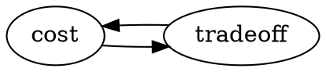
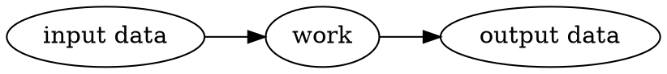
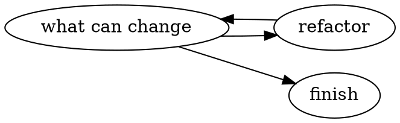
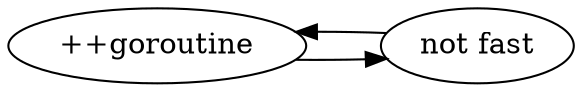

# Ultimate Go Advanced Workshop

Note: better seen in https://hackmd.io/CbAsA4DZwTgMwLQGMCMB2NDTAKYwQIZJw4IBGSwK4ArDeAZDAMxA for diagrams etc.


- Bill Kennedy - bill@ardanlabs.com
- https://twitter.com/goinggodotnet
- Interesting related podcast - https://changelog.com/gotime-6

## About us


From left to right:

- Hernán Kleiman - https://twitter.com/justiniano
- Sergio Moya - https://twitter.com/soyelsergillo
- Gonzalo Serrano - https://twitter.com/gonzaloserrano
- Ferran Orriols - https://twitter.com/ferranorriols
- Alberto Fernández - https://twitter.com/albertofem

#### Sponsored by Social Point

- https://twitter.com/socialpointeng
- http://www.socialpoint.es

### Related

GolangUK '16 hackpad https://hackmd.io/s/B1CAXxXq

## install

```
$ go get https://github.com/ardanlabs/gotraining
$ cd $GOPATH/src/github.com/ardanlabs/gotraining
$ go get ./...
$ go run main.go
Listening on port 8080
```
## 101

https://github.com/ardanlabs/gotraining/tree/master/reading

https://github.com/ardanlabs/gotraining/blob/master/reading/design_guidelines.md

- integrity
  - go does not let you hide the cost of your code
  - go has no type casting (but you have type assertion)
- readability
  - > "do i understand what's happening?"
  - go has not operator overloading so you understand the code you read
  - a method is less readable than a function because it hides things related to the receiver (e.g the receiver has state and state is the root of all evil)
    - a function requires all the input, so it's readable by itself, and doesn't hide any logic.
  - comments in code are very important
- simplicity
  - less is always more
  - it seems its all about algorithm simplicity. **Do not waste effort**.
  - efficiency can hurt readability and simplicity
  	- why did you do an "efficient" version?
  	- have you tried to do the readable version first?
  	- have you done any benchmarks? is that function really your bottleneck? do you know what cost does it have?
- performance
  - func calls have massive cost but if you dont have it you lose readability

## Data oriented design

https://github.com/ardanlabs/gotraining/blob/master/reading/design_guidelines.md#data-oriented-design


> If you don't understand the data, you don't understand the problem.

- take the day off and go to the beach :lollipop: 
- you are more productive when you don't touch the keyboard
- bug? don't put prints; step back and **THINK**
- use the delve debugger
	- unless you are in prod => logs
	- be careful with logs
		- make sure they work all the way through
- every day your code is not in production is technical debt unless you work at Google <-- LOL

> All problems are unique and specific to the data you are working with.

> Data transformations are at the heart of solving problems. Each function, method and work-flow must focus on implementing the specific data transformations required to solve the problems.



> If your data is changing, your problems are changing. When your problems are changing, the data transformations needs to change with it.

> Uncertainty about the data is not a license to guess but a directive to STOP and learn more.

> Solving problems you don't have, creates more problems you now do.

- do not write code if you are not gonna need it. You are writing code that is purely technical debt 
- "we will need this in the future" -> SMELL. Supposed you're fired, then what?

> If performance matters, you must have mechanical sympathy for how the hardware and operating system work.

> Minimize, simplify and REDUCE the amount of code required to solve each problem. Do less work by not wasting effort.

> Code that can be reasoned about and does not hide execution costs can be better understood, debugged and performance tuned.

> Coupling data together and writing code that produces predictable access patterns to the data will be the most performant.

- how to write code sympathethic with the hardware
- if data changes, code changes. To avoid large changes in the code -> interface and composition design

> Changing data layouts can yield more significant performance improvements than changing just the algorithms.

> Efficiency is obtained through algorithms but performance is obtained through data structures and layouts.

#### caching.go example 

https://github.com/ardanlabs/gotraining/blob/master/topics/benchmarking/caching/caching.go

- linked list traversal
- row vs column traversal
	- the code is the same
	- why 2 funcs?
- caching_test.go test & benchmark
```
╰─○ go test -run none -bench . -benchtime 3s
Elements in the link list 4194304
Elements in the matrix 4194304
testing: warning: no tests to run
BenchmarkLinkListTraverse-4   	     500	   7783710 ns/op
BenchmarkColumnTraverse-4     	    1000	   6094762 ns/op
BenchmarkRowTraverse-4        	    1000	   4120913 ns/op
```

The bench shows that row traversal is faster (less time per op). Why? The algo is the same! This is because how go arrays are stored in memory.

## CPU arch

Video time: https://www.youtube.com/watch?v=WDIkqP4JbkE minuto 18:51
  - cache & memory hierarchy (in 1 core)
```sequence
registers->L1: in core
L1->L2: in core
L2->L3: in core
L3->Main memory: out of core
```
  - main memory is useless if you care about performance
  - > small is fast
  - he talks about CPU design and structions execution
  	- you need **at least** 4 CPU cycles to execute an instruction: fetch, decode, execute, result store?
    - start making predictions -> this is about branch predicion in CPU design (https://en.wikipedia.org/wiki/Branch_predictor)
	- segmentation / pipelining => parallel execution
  - we are not responsible for instruction optimitzation -> compilers and so do that
  - **but we are responsible for data optimitzation** 
  - **cash line**: how do we put our data in cache L1? if we put things in L1 what was in L1 will go to L2, L2 things will go to L3, L3 to main memory etc
  	- optimize for latency
  	- we do that with predictable data access patterns
  	- data needs to be as contiguously as possible
  	- that's call linear access to data
  	- arrays in go do that
	- array iteration is a predictable access pattern; hardware is very good at that
	- go just have arrays, slices (which are arrays) and maps (they are also contigous blocks of data) because **they are sympathethic with the hardware**.
	- func calls and stack access also is contiguous in memory
	- TLB (Translation Lookahead Buffer) is a buffer that maps virtual memory to phisical memory. An OS mem page is 4KB. 
- **you just have a performance issue if performance is an issue**
- object oriented patterns are about linked lists and they are not data 
	- **separate data from behaviour**
		- in go behaviour and state are separate: eg method vs method receiver
	    - when you declare a method it's technically declared outside the type
- in designing performant software, don't think about patterns and ???, think about principles

**AFTER BREAK:**
- **as we said before**: when data is changing your algorithm needs to change.
- change is good, your company is better if can adapt to changes quicker
- with interfaces you can abstract changes

## Interfaces and composition design

https://github.com/ardanlabs/gotraining/blob/master/reading/design_guidelines.md#interface-and-composition-design

> Interfaces provide the highest form of decoupling when the concrete types used to implement them can remain opaque.

> Decoupling means reducing the amount of intimate knowledge code must have about concrete types.

> Interfaces with more than one method has more than one reason to change.

> You must do your best to understand what could change and decouple those aspects of your code.
> Uncertainty about change is not a license to guess but a directive to STOP and learn more.

What can change? Do we know? Have we got enough information?



refactor ~ add a level of abstraction

> Recognizing and minimizing cascading changes across the code is a way to architect adaptability and stability in your software.

> When dependencies are weakened and the coupling loosened, cascading changes are minimized and stability is improved.

> The standardization of interfaces can set clear and consistent expectations.


#### Composition example

See all the example steps:
https://github.com/ardanlabs/gotraining/blob/master/topics/composition

- API design:
	- create the Data every time we call the Pull method and return it => It allocates memory every time we call it.
	- **VS** receive the Data pointer and use it inside the Pull method => since there is repetition here, you save allocations because you just do one allocation outside instead of multiple inside
- **you can't eliminate allocation but your job is to reduce it as much as possible**
- **make benchmarks to take decisions about performance**. Think about the cost of the API
- so, he solved the problem in a concrete way. Also taking care of allocations. **GOOD**. That's step 0.
- now, what can change?
	- more data to copy, not just `Xenia` and `Pillar` as source and destination.
	- this change leads to refactor
	- refactor leads to add abstractions in behaviour: contracts! e.g `Puller` and `Storer` which will lead to a generalization of the algorithm
	- due to go having **implicit interface implementation**, changing the main algo is enough to make it run :smiley: no need to change the implementers of them since we abstracted the behaviour from them
	- interface composition: `PullStorer` (Interface Seggregation Principle). See: https://github.com/ardanlabs/gotraining/blob/master/topics/composition/example3/example3.go#L39
	- again, 1 method per interface + interface composition is better than >1 method per interface and less interfaces. (of course only if it make sense)
	
> Step by step. Do not early refactor your code. It can delay your production release.
	
### Interface Pollution

https://github.com/ardanlabs/gotraining/blob/master/reading/design_guidelines.md#interface-pollution

> when you declare an interface for the wrong reason

when to use interfaces:
- contract
- several implementations (**ONLY** if they are gonna be used)
- testing appliance:
  - he says that adding an interface because you need later to mock for testing is not good design
  - take advantage that Golang does not need the `implement` keyword. Make your own interfaces **for your tests**

## Garbage Collector

#### Memleak in C

You track the malloc()'s and the free()'s and find who caused the memleak.

#### Memleak in Go

- difficult because you don't actually know if a reference is still being used or not (or something like that :)
- you can't use htop, VM stats and things like that to detect memleaks in Go
- you need to profile!

## Microservices
- they don't solve a technical problem, they solve a workflow/management problem
- they are THE HELL
- devops microservices is HELL TOO
- deal with a lot more complexity:
	- service discovery
	- configuration
	- distributed tracing
	- deploying
	- communication
- start your project JUST if you know how to do (**one of the best workshop moments**. Lot of laughs!):
	1. logging
	2. configuration
	3. tracing (distributed)
	4. metrics

## Concurrency

- managing different things at the same time.

### multithreading

- runs fine on Linux, sucks in Windows
- we have to actively find the breaking point where the software can't scale up even increasing the computer resources.
- less is always more. If you can solve the problem using less cores, less schedule processing time you will have.

### Goroutines

- think about other breaking points in our infrastructure. Is our database accepting all the connections we are doing through this tons of goroutines?
	- this happened to me several times doing dynamo backups, in the end the bottleneck was the network so adding goroutines didn't help --gonzalo
- solve your problem with just 1 goroutine. It is fast enough? Fine. Is not? Add another goroutine. Repeat. **LESS IS ALWAYS MORE**



code review note:
  - he goes behind of of his devs
  - he asks: why did you write those lines of code?
  - no answer => lets go for a walk :dancer: 

#### scheduling

- goroutines are green threads https://en.wikipedia.org/wiki/Green_threads
- the scheduler runs in user-mode. An OS program can run in user mode and kernel mode.
- is an undeterministic, pre-emptive scheduler
- `go funcName()`, goroutine execution, channels and syscalls provoke the scheduer to take decisions
- go network poller https://morsmachine.dk/netpoller

### concurrency management

#### lifetime

**[rule1. your software must start-up cleanly and finish cleanly]**: **when** does that goroutine start and finish, and **how**?
  	  - `CTRL+C`. 10K requests must finish cleanly.
  	  	- we use that in bsk with the UnixSignalAdapter and context.Done()
  	  	- another lib: https://github.com/braintree/manners

#### channels 
- **are slow**. Don't use channels if you can use:
  - atomic funcs
  - mutexes
- are for orchestration, not share mutable state 
- Bill started building code using channels everywhere and found that channels are not queues, they are about garantees about goroutine communication: no data is lost. Rob Pike's videos (https://www.youtube.com/watch?v=f6kdp27TYZs) they all use unbuffered channels.
- Buffered channels are like giving your wife's letter to Ed without knowing if the got it => YOU ARE SCREWED AND YOUR WIFE WILL KILL YOU
- goroutines (its number) should be your buffer, not the buffer of a buffered channel.
- **backpressure** is when your goroutines can't catch up with the messages thrown at the channel
	- Use metrics counters for send and receive
	- (gonzalo) see Akka streams http://doc.akka.io/docs/akka-stream-and-http-experimental/1.0-M2/scala/stream-flows-and-basics.html and Elixir GenStage http://elixir-lang.org/blog/2016/07/14/announcing-genstage/
	- Bill always looks at metrics that show the backpressure between goroutines
	- buffers for continuity are good (continuity in processing the job needed to do)
	- buffers don't give performance, it can give you latency and other problems (e.g TCP avoids congestion at all costs)
	- you **HAVE TO know** what your backpressure is and mesure it
	- trick: put a delay in channel sending (or receiving?) of 100ms to check what are the implications of backpressure
	- creating more goroutines without understanding backpressure
	- how do you relief backpressure?
	- e.g 10K rps at 100ms processing. One day processing is 1h and causes to have 100K goroutines instead of 10K. He looks at graphs and sees backpressure increase in a certain channel.
	- **[rule3: to relase backpressure you need timeouts]**: simple technique, add a timeout in the channel select with `<-timer.After(timeout)` 
	- **key concepts** for concurrency architecturing: integrity (garantees), orchestration, risks, backpressure, continuity.

## profiling

### Example 1

```
cd $GOPATH/src/github.com/ardanlabs/gotraining/topics/profiling/project
go get ./...
go run main.go
2016/08/17 15:17:53.430957 service.go:64: Listening on: localhost:5000
```
Open http://localhost:5000/search + some code explanation

### howto

https://github.com/ardanlabs/gotraining/blob/6afa2611f7fb0a5ae837e6fdb05a0693cabcbc91/topics/profiling/README.md

- adding load: `boom -m POST -c 8 -n 100000 "http://localhost:5000/search?term=house&cnn=on&bbc=on&nyt=on"`
	- result: https://gist.github.com/gonzaloserrano/fc81ea6ec2aed8e0fca090dcabf0b452
- use GODEBUG for tracing: `GODEBUG=gctrace=1 ./project > /dev/null`
  - result: https://gist.github.com/gonzaloserrano/16aee1fe5881743af1fead0324104378

We want to see the GC algo to be consistent on the expectations of what our program is doing.

#### Explanation

https://github.com/ardanlabs/gotraining/tree/6afa2611f7fb0a5ae837e6fdb05a0693cabcbc91/topics/profiling/godebug/gctrace

Fields explanation: https://github.com/ardanlabs/gotraining/tree/6afa2611f7fb0a5ae837e6fdb05a0693cabcbc91/topics/profiling/godebug/gctrace

```
gc 3233 @53.279s 5%: 0.009+3.0+0.14 ms clock, 0.039+0/2.9/5.3+0.57 ms cpu, 4->4->1 MB, 5 MB goal, 4 P
```
Loot at: `4->4->1 MB, 5 MB goal`
This looks like that in every line, so its OK in memory. The heap never doubled in size (which is what the go runtime does when running out of heap memory).

In a program with memleaking, those numbers are incresing with every line! We can't see this with htop etc, we need this tool!

### backpressure

```
GODEBUG=schedtrace=1000 GOMAXPROCS=1 ./project > /dev/null
```
```
SCHED 0ms: gomaxprocs=1 idleprocs=0 threads=3 spinningthreads=0 idlethreads=0 runqueue=0 [0]
SCHED 1006ms: gomaxprocs=1 idleprocs=1 threads=6 spinningthreads=0 idlethreads=0 runqueue=0 [0]
SCHED 2006ms: gomaxprocs=1 idleprocs=0 threads=9 spinningthreads=0 idlethreads=3 runqueue=0 [0]
SCHED 3009ms: gomaxprocs=1 idleprocs=0 threads=9 spinningthreads=0 idlethreads=4 runqueue=8 [1]
SCHED 4019ms: gomaxprocs=1 idleprocs=0 threads=9 spinningthreads=0 idlethreads=4 runqueue=6 [5]
```
```
Summary:
  Total:	54.8261 secs
```
With 1 proc the backpressure looks good (see last number). We don't need it to be 0, we are ok with a small number of backpressure.

```
GODEBUG=schedtrace=1000 GOMAXPROCS=4 ./project > /dev/null
```
```
SCHED 0ms: gomaxprocs=4 idleprocs=1 threads=6 spinningthreads=1 idlethreads=0 runqueue=0 [0 0 0 0]
SCHED 1010ms: gomaxprocs=4 idleprocs=4 threads=8 spinningthreads=0 idlethreads=2 runqueue=0 [0 0 0 0]
SCHED 2010ms: gomaxprocs=4 idleprocs=0 threads=12 spinningthreads=0 idlethreads=3 runqueue=1 [0 0 4 0]
SCHED 3013ms: gomaxprocs=4 idleprocs=0 threads=12 spinningthreads=0 idlethreads=3 runqueue=3 [2 1 0 1]
SCHED 4022ms: gomaxprocs=4 idleprocs=0 threads=12 spinningthreads=0 idlethreads=3 runqueue=2 [4 4 0 2]
SCHED 5033ms: gomaxprocs=4 idleprocs=0 threads=12 spinningthreads=1 idlethreads=3 runqueue=0 [0 0 2 0]
SCHED 6040ms: gomaxprocs=4 idleprocs=0 threads=12 spinningthreads=0 idlethreads=3 runqueue=3 [1 4 1 0]
SCHED 7043ms: gomaxprocs=4 idleprocs=0 threads=12 spinningthreads=1 idlethreads=3 runqueue=0 [0 0 0 0]
SCHED 8047ms: gomaxprocs=4 idleprocs=0 threads=12 spinningthreads=0 idlethreads=2 runqueue=1 [1 2 0 0]
```
```
Summary:
  Total:	30.0159 secs
```
We are just using at most 4 cores, we don't need as much.

Lets try 2 cores:
```
GODEBUG=schedtrace=1000 GOMAXPROCS=2 ./project > /dev/null
```
```
SCHED 0ms: gomaxprocs=2 idleprocs=1 threads=3 spinningthreads=0 idlethreads=0 runqueue=0 [0 0]
SCHED 1004ms: gomaxprocs=2 idleprocs=2 threads=7 spinningthreads=0 idlethreads=1 runqueue=0 [0 0]
SCHED 2007ms: gomaxprocs=2 idleprocs=0 threads=11 spinningthreads=0 idlethreads=5 runqueue=2 [9 5]
SCHED 3008ms: gomaxprocs=2 idleprocs=0 threads=11 spinningthreads=0 idlethreads=4 runqueue=5 [1 5]
SCHED 4011ms: gomaxprocs=2 idleprocs=0 threads=11 spinningthreads=0 idlethreads=4 runqueue=4 [3 2]
SCHED 5015ms: gomaxprocs=2 idleprocs=0 threads=11 spinningthreads=0 idlethreads=4 runqueue=4 [2 0]
```
```
Summary:
  Total:	34.2151 secs
```

### pprof


Import + start an HTTP endpoint with useful info.

http://localhost:5000/debug/pprof

Also the RAW prof data:
  - block
  - goroutine
  - heap
  - threadcreate
  
#### Visualitzation of the data.

- profiling should be done in same environment as you have in production. Otherwise is useless.
- Bill also profiles in prod directly but you have to have in mind security and the exposed http endpoints.
- ideally you would write benchmark functions that emulate your production traffic.

#### memory
```
go tool pprof ./project http://localhost:5000/debug/pprof/heap
```
starts pprof interactive mode
  - `top --cum`: allocations
  - `web`: call graph from memory perspective (golang's blackfire)
  	- `0 of X (66%)` means: this call causes 66% of allocations but this func is not provoking it, but a func called from here is.
  - `list Search`: we see `rssSearch()` causes 1MB of alloc
  - `list rssSearch`: we see `xml.NewDecoder()` causes it 
  - `web list Search`
 
#### cpu
  
```
go tool pprof ./project http://localhost:5000/debug/pprof/profile
```

#### go-torch
uses pprof to generate flame graphs

#### profile comparison
pprof allows you to compare two profiles

more info: https://github.com/ardanlabs/gotraining/blob/6afa2611f7fb0a5ae837e6fdb05a0693cabcbc91/topics/profiling/README.md#comparing-profiles

### benchmarking + tests

Example: https://github.com/ardanlabs/gotraining/blob/835274d12dae88314662c896df4917e1e0c4e03f/topics/profiling/benchmarks/stream.go

- benchmark 4 algorithms
- benchmark + profile -> nice! can this avoid doing profiling in pro?
  - start pprof: `go tool pprof... cpuinfo` cpu.out
  - `list algOne`
  - see memory
  	- `go test -bench -benchmem -memprofile...` mem.out
  	- `go tool pprof -allocspace benchmarks.test mem.out`
  
So the flow would be something like:
 - profile
 - find bottleneck
 - benchmark changes
 - pick up the best one or see if we gain something
 - repeat
 - ...
 - profit
 - go for a walk with Bill (lol)

### tracing

```
go test -v -trace trace.out
```
```
go tool trace trace.out
```
- It opens an interactive page with profiling links in order to explore the traces. Available links: trace, sched, ...

	- `trace link` It makes an interactive trace which shows you the threads and goroutines
- go build -gcflags -m 
	- `...escapes to heap` => produces memory allocation because it does not use the stack
	
	
## end

:clap: :clap: :clap: :clap: :clap: 

